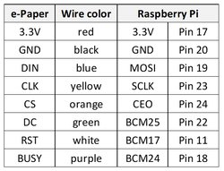
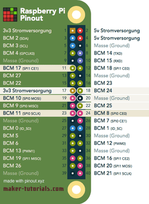
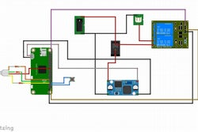

# bandwidth-monitor
Using a raspberry pi to monitor continously the bandwidth of wifi at home.

## Hardware connection

##### E ink connection

##### Raspberry pi pinout

##### General connection

## Installation

1. Install Raspberry Pi OS (RPO)
2. Connect the raspberry pi to the home WIFI
3. Update and Upgrade RPO 
    - `sudo apt-get update && sudo apt-get upgrade -y`
4. Clone this repo
    - `git clone https://github.com/sven-borden/bandwidth-monitor.git`
5. Install dependencies
    - `pip3 install -r requirements.txt`
    - `sudo apt-get install ttf-mscorefonts-installer`
    - Follow instruction on this page : https://www.waveshare.com/wiki/Pioneer600#Libraries_Installation_for_RPi
6. From `sudo raspi-config`
    - Enable SSH
    - Enable SPI
    - Enable I2C
7. Make python files and scripts executable
    - `sudo chmod +x src/*.py`
    - `sudo chmod +x speedtest-cron.sh`
8. Open `crontab -e` and add following lines
    - `@reboot /usr/bin/python /home/pi/bandwidth_monitor/post_restart_message.py &`
    - `@reboot sleep 30 && /usr/bin/python /home/pi/bandwidth_monitor/poll_test_now_button.py`
    - `*/30 * * * * /usr/bin/python3 /home/pi/bandwidth_monitor/src/bandwidth_monitor_0_4.py`
    - `*/3 * * * * /usr/bin/python /home/pi/bandwidth_monitor/poll_killswitch.py`
    - `13 03 * * * /usr/bin/python /home/pi/bandwidth_monitor/refresh_display.py`